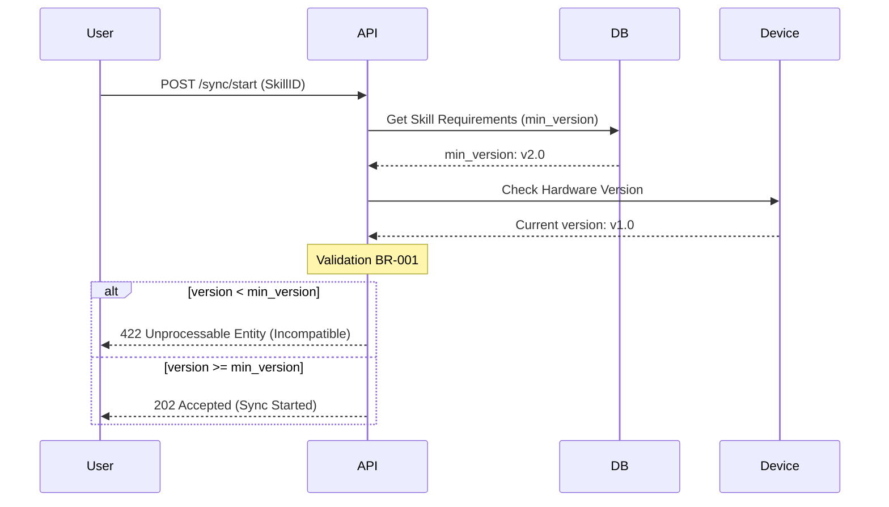

# Проект: NeuroShelf API

Автор: Роман Семенов  
Роль в проекте: System Analyst  
Стек технологий: REST API, PostgreSQL (Supabase), OpenAPI/Swagger, Postman, PlantUML.

# Вступление
С изобретением NeuroLink все изменилось.  
Человек получил возможность обмениваться генетической памятью и навыками.  
Теперь навыки стали физической единицей, объектом хранения и торговли.  
Каждый, обладая импланотом NeuroLink, получал возможность в считанные часы стать пилотом, музыкантом, бойцом ММА, не говоря уже о разговорных языках или знаниях школьных предметов.
Как это сделать?
Просто загрузив пакет навыков из библиотеки NeuroShelf.

# Проблематика и Цели
Рынок нейронных модификаций страдает от фрагментации.   
Существует более 50 версий имплантов NeuroLink, и установка навыка на несовместимое оборудование приводит к фатальным сбоям в нейронной сети пользователя.

**Проблема:**  
Существующие системы дистрибуции навыков не имеют единого стандарта проверки совместимости «софт-железо», что приводит к убыткам корпораций и рискам для клиентов.

**Цель проекта:**  
Спроектировать архитектуру API, которая на уровне протокола исключает возможность загрузки несовместимого SkillPack, сокращая количество критических ошибок нейросети до 0%.  

# Глоссарий
**NeuroLink** - устройство, имплантируемое в тело человека, для чтения/записи памяти  (имеет версию v.X.Y).  

**SkillPack** - (или просто 'Pack') единица генетической памяти, навыка. Имеет ограничение по версии NeuroLink.  

**NeuroShelf** - представляет собой онлайн библиотеку навыков, которые можно использовать авторизованным пользователям.  

**Sync** - процесс загрузки навыка в мозг пользователя.
# Бизнес-логика (Business Rules)
- **BR-101 (Совместимость):** Поле `min_link_version` в SkillPack должно быть меньше или равно текущей версии `neuro_version` пользователя.
- **BR-102 (Валидация):** Перед началом Sync система должна получить аппаратный хеш-код импланта для подтверждения его подлинности.
- **BR-103 (Ограничение):** Один пользователь не может одновременно запускать более двух процессов Sync (ограничение пропускной способности коры головного мозга).

# Техническая документация
- [Спецификация OpenAPI (Swagger)](ссылка_на_файл) — описание всех эндпоинтов и моделей данных.
- [Коллекция Postman](ссылка_на_файл) — готовые сценарии для тестирования API.
- [Схема БД на dbdiagram.io](ссылка) — структура таблиц PostgreSQL.
